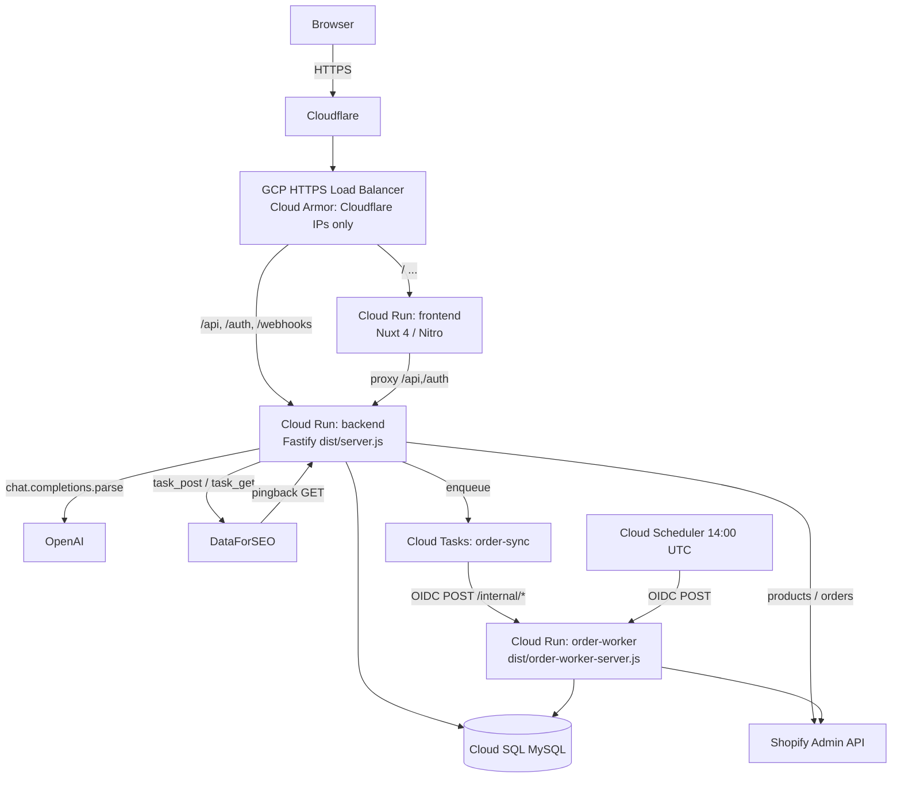

# AI_CONTEXT

Permanent context for AI assistants working on this repository. Every statement
here is verifiable from the code as of this writing. Where the code and the
older prose docs (`README.md`, `k8s/README.md`) disagree, **the code is
authoritative** and the divergence is called out under *Known Technical Debt*.

---

## Project Overview

- **Purpose:** Price Insight is an internal tool that helps a small online
  retailer decide how to price its Shopify products by comparing them against
  live competitor listings and the store's own sales history.
- **Business domain:** eCommerce competitor price monitoring and pricing
  recommendation for a Shopify merchant (New Zealand / Australia market — see
  `location_code 2554`, NZD/`nz` defaults, and NZ/AU competitor filtering).
- **Major features (verified in code):**
  - Product & order import from Shopify (`ShopifyService`, `ShopifyGraphQLService`,
    `ProductRepository`, `OrderRepository`).
  - Competitor discovery via DataForSEO Google Shopping + Product Info tasks,
    delivered asynchronously through pingback webhooks (`DataForSeoService`,
    `apps/backend/src/routes/dataforseo-webhook.ts`, `competitor-filter.ts`).
  - Statistical price position/margin analysis (`packages/core/src/core.js`
    `analyzePrice`, mirrored in `apps/backend/src/lib/price-analysis.ts`).
  - AI reports built from product + confirmed competitors + sales history via
    OpenAI structured output (`AiReportService`).
  - Nuxt dashboard (products, competitors, orders, insight pages) behind a
    single shared-password login.

---

## Repository Structure

Turborepo monorepo, pnpm workspaces (`pnpm-workspace.yaml` → `apps/*`,
`packages/*`). Package manager pinned to `pnpm@10.28.2` (root `package.json`).

```
price-insight/
├── apps/
│   ├── backend/     # @price-insight/backend — Fastify 5 API (TypeScript)
│   └── frontend/    # @price-insight/frontend — Nuxt 4 dashboard (Vue 3)
├── packages/
│   └── core/        # @price-insight/core — pure-JS price analysis + CLI bins
├── infra/
│   ├── terraform/   # Google Cloud Run + Cloud SQL + LB + IAM (authoritative infra)
│   └── deploy-backend.sh   # local/manual mirror of the CI deploy flow
├── k8s/             # LEGACY GKE manifests — NOT the current deploy path
├── .github/workflows/   # build.yml, deploy.yml, infra-terraform*.yml
├── scripts/         # test-db-connection.ps1
├── CLAUDE.md        # instructions for Claude Code (authoritative, current)
├── AGENTS.md        # AI-worker worktree rules
└── README.md        # high-level prose — partly STALE (see Technical Debt)
```

**Applications & packages**

| Name | Path | Role |
|------|------|------|
| `@price-insight/backend` | `apps/backend` | Fastify API; owns DB, all integrations, business logic. Also builds a second entrypoint `dist/order-worker-server.js`. |
| `@price-insight/frontend` | `apps/frontend` | Nuxt 4 SSR dashboard; proxies `/api/**` and `/auth/**` to the backend. |
| `@price-insight/core` | `packages/core` | Pure-JS `analyzePrice` library + `price-insight` / `price-insight-extract` CLI bins. Not imported by the apps at runtime; backend has its own `lib/price-analysis.ts`. |

---

## Technology Stack

Only versions/tools present in manifests are listed.

**Frontend** (`apps/frontend/package.json`)
- Nuxt `^4.2.0`, Vue `^3.5.13`, `vue-router` `^4.5.1`
- `@nuxt/ui` `^4.6.1` (Tailwind CSS v4 under the hood), `@nuxt/eslint`
- Nitro server output; a single server route `server/api/health.ts`

**Backend** (`apps/backend/package.json`)
- Fastify `^5.4.0` with `@fastify/cookie`, `@fastify/cors`, `@fastify/jwt`
- Drizzle ORM `^0.44.2` + `mysql2` `^3.15.1`; `drizzle-kit` `^0.31.1`
- Zod `^3.24.4` (env + request + OpenAI response schemas)
- `openai` `^5.1.0`; `@google-cloud/tasks` `^6.1.0`; `google-auth-library`
- TypeScript `^5.8.3` (strict, `NodeNext`, ES2022), `tsx` for dev/scripts
- Vitest `^4.1.7` (+ `@vitest/coverage-v8`); ESLint `^10` + `typescript-eslint`

**Infrastructure / Cloud**
- Google Cloud Platform, project `wd-tools`, region `australia-southeast1`
- **Google Cloud Run** for all three services (frontend, backend, order-worker)
- **Cloud SQL** MySQL (`wd-tools:australia-southeast1:wd-tools`) via the built-in
  Cloud SQL connector volume (`/cloudsql`)
- **Google Secret Manager** for runtime secrets
- **Google Cloud Tasks** (queue `order-sync`) + **Cloud Scheduler** (`scheduled-order-discovery`)
- **Google Artifact Registry** for images (`australia-southeast1-docker.pkg.dev/wd-tools/price-insight/…`)
- External HTTPS **Load Balancer** with serverless NEGs + **Cloud Armor** (Cloudflare-only)
- **Terraform** (`hashicorp/google ~> 6.0`), state in GCS bucket `wd-tools-tfstate`

**Database**
- MySQL 8 + Drizzle ORM. Schema: `apps/backend/src/db/schema.ts`. Migrations:
  `apps/backend/src/db/…` → SQL in `apps/backend/drizzle/*.sql` (7 migrations,
  `0000`–`0006`). Connection created in `apps/backend/src/db/index.ts`.

**Queues**
- Google Cloud Tasks (`order-sync` queue, `retry max_attempts=3`, concurrency 1).
  Clients: `CloudTasksOrderSyncClient`, `CloudTasksCompetitorClient`. There is
  **no BullMQ and no Redis** in the current code.

**Caching**
- None in current code. No Redis dependency in `apps/backend/package.json`; no
  cache client wired in `app.ts`. (The `k8s/redis/` manifests and README Redis
  references are legacy — see Technical Debt.)

**Authentication**
- Single shared password. `apps/backend/src/routes/auth.ts`: `POST /auth/login`
  compares the submitted value against `sha256(DEV_AUTH_PASSWORD)`, issues a
  7-day JWT signed with `SESSION_SECRET`, stored in an httpOnly `pi-session`
  cookie. `GET /auth/session` verifies it. Protected API routes are guarded by
  `requireSession` (`app.ts` registers a sub-scope with a `preHandler`). Frontend
  guard: `apps/frontend/app/middleware/auth.global.ts`. **No Google OAuth in
  current code** despite README/`.env.example`.

**Testing**
- Vitest (`apps/backend/vitest.config.ts`, `include: src/__tests__/**/*.test.ts`).
  ~25 backend test files under `apps/backend/src/__tests__/` with helpers
  (`helpers/build-app.ts`, `helpers/mock-db.ts`). Core has node-based tests
  (`packages/core/test/*.test.js`) run via `node`.

**Deployment**
- Cloud Run, image-per-commit-SHA, deployed by digest. Migrations applied by the
  `backend-migrate` Cloud Run Job **before** traffic is routed. Two paths: CI
  (`.github/workflows/deploy.yml`) and local (`infra/deploy-backend.sh`).

---

## Architecture

Three Cloud Run services share one backend Docker image (frontend has its own):



**Service responsibilities**
- **frontend** — SSR UI only. Ingress restricted to the internal load balancer
  (`INGRESS_TRAFFIC_INTERNAL_LOAD_BALANCER`). Proxies `/api/**` and `/auth/**`
  to the backend using `NUXT_BACKEND_URL` baked at build time (`nuxt.config.ts`,
  `apps/frontend/Dockerfile` `ARG NUXT_BACKEND_URL`).
- **backend** — the full API (`apps/backend/src/app.ts` `buildApp`). Owns auth,
  products, orders, competitors/analysis, reports, and both webhook receivers.
- **order-worker** — same image, narrower entrypoint
  (`apps/backend/src/order-worker-server.ts`). Registers only `/internal/*`
  routes; skips OpenAI/DataForSEO/auth wiring to match its least-privilege
  secret scope. Private: invoked only via OIDC by Cloud Tasks / Cloud Scheduler
  (no `allUsers` invoker binding).

**Data flows**
1. **Product / order import** — `POST /api/products/sync` (or `/import`) and
   `POST /api/orders/sync`; `ShopifyService`/`ShopifyGraphQLService` fetch from
   Shopify, repositories upsert into MySQL. Scheduled order discovery runs on
   order-worker via Cloud Scheduler (`/internal/scheduled-order-discovery`),
   fanning out per-order sync tasks onto Cloud Tasks.
2. **Competitor discovery** (async) — `POST /api/products/:id/competitors/search`
   / `CompetitorAnalysisService.searchAndSuggest` post DataForSEO shopping tasks
   with a pingback URL. DataForSEO calls back to
   `GET /webhooks/dataforseo/pingback/shopping`, which (if Cloud Tasks is
   configured) enqueues `process-shopping-pingback`, else processes inline: it
   fetches results, filters (`filterByCountryAndPriceRange`, NZ/AU + price band),
   then posts Product Info tasks whose pingback hits
   `/webhooks/dataforseo/pingback/product_info` → upserts suggested competitors +
   price history. Secret validated with `timingSafeEqual`.
3. **AI report** — `POST /api/products/:id/reports/ai` → `AiReportService`
   assembles `{ product, confirmed competitors (≤20), anonymised sales (PII
   stripped) }`, hashes the input, records a `pending` row, calls
   `openai.chat.completions.parse` with a Zod `response_format`, and stores the
   parsed output (or failure) in `product_ai_reports`.

**Database tables** (`schema.ts`): `products`, `product_images`, `competitor`,
`competitor_products`, `price_history`, `price_insights`, `customers`,
`customer_addresses`, `orders`, `order_items`, `product_ai_reports`. Money uses
`decimal(12,4)`; Shopify IDs are unsigned `bigint`.

---

## Coding Standards

Documented from what the code already does — not prescriptions.

- **TypeScript strict, ESM everywhere.** Backend `tsconfig.json`: `strict: true`,
  `module`/`moduleResolution: NodeNext`, `target: ES2022`, `type: module`.
  Relative imports use explicit `.js` extensions (NodeNext), e.g.
  `import … from "./db/index.js"`.
- **Layering:** `routes/` (HTTP) → `services/` (integrations + orchestration) +
  `services/*-repository.ts` (Drizzle data access) → `db/schema.ts`. Pure helpers
  live in `lib/`; env parsing in `config/env.ts`.
- **Dependency injection via Fastify decorators.** `buildApp` constructs
  repositories/services once and `app.decorate(...)`s them (typed in
  `types/fastify.d.ts`); routes read them off `fastify`.
- **Validation with Zod at the boundary.** Env (`config/env.ts`), request bodies
  (`schemas/*.ts`), and OpenAI output (`zodResponseFormat`).
- **Errors:** throw `AppError(statusCode, code, message)` (`lib/app-error.ts`);
  the single error handler in `app.ts` maps `AppError`/`ZodError`/unknown to a
  `{ error: { code, message } }` shape.
- **Naming:** files kebab-case (`competitor-analysis-service.ts`), classes
  PascalCase, DB columns snake_case mapped to camelCase in Drizzle.
- **Lint:** flat ESLint config, `typescript-eslint` recommended; unused args must
  be `_`-prefixed; `no-explicit-any` relaxed only in tests.
- **Tests:** colocated under `src/__tests__/`, `*.test.ts`, Fastify app built via
  `helpers/build-app.ts` against a mock DB.

---

## External Integrations

| Service | Where | How it works |
|---------|-------|--------------|
| **Shopify Admin API** | `services/shopify-service.ts`, `services/shopify-graphql-service.ts` | Client-credentials token (`getAccessToken`), REST products/orders + GraphQL for order detail and inventory cost enrichment. Configured by `SHOPIFY_*` env; services are `null` when unset. |
| **DataForSEO** | `services/dataforseo-service.ts`, `routes/dataforseo-webhook.ts` | Basic-auth REST. Posts Google Shopping + Product Info tasks with a pingback URL (`WEBHOOK_HOST`); results arrive via authenticated GET pingbacks. `location_code 2554`, `language_code en`, NZD filtering. |
| **OpenAI** | `services/ai-report-service.ts` | `chat.completions.parse` with a Zod `response_format`; model from `OPENAI_MODEL` (default `gpt-4.1-mini`). Inline `SYSTEM_PROMPT` constant. |
| **Google Cloud Tasks / Scheduler** | `services/cloud-tasks-*.ts`, `cloud-tasks.tf` | Enqueue order-sync and competitor-pingback processing; OIDC-authenticated pushes to order-worker's `/internal/*`. Optional locally (inline fallback when unset). |
| **SerpAPI** | `services/serp-api-service.ts` (+ `investigate-serp.ts`) | Present but not wired into `app.ts`; superseded by DataForSEO. Retained code — see Technical Debt. |

---

## Infrastructure

All authoritative infra is Terraform under `infra/terraform/` (state in GCS
`wd-tools-tfstate`, `prefix price-insight/terraform.tfstate`).

- **Cloud Run services** (`cloud-run.tf`): `frontend` (internal-LB ingress,
  port 3000), `backend` (public, port 4000, Cloud SQL volume), `order-worker`
  (public ingress but IAM-gated; command overridden to
  `node dist/order-worker-server.js`, port 8080). All start on a bootstrap
  placeholder image; `lifecycle.ignore_changes` on `image`/`client`/`traffic`
  lets CI's `gcloud run deploy` own the real image without Terraform reverting it.
- **Cloud Run Jobs** (`cloud-run-jobs.tf`): `backend-migrate`
  (`node dist/db/run-migrations.js`) and `backend-script-runner`
  (`dist/scripts/*.js`), reusing the backend image/SA/env.
- **Load balancer** (`load-balancer.tf`): one global HTTPS LB; URL map routes
  `/api*,/auth*,/webhooks*` → backend, everything else → frontend; managed SSL
  for `var.domain` + apex redirect; HTTP→HTTPS redirect.
- **Cloud Armor** (`cloud-armor.tf`): frontend backend service allows only
  Cloudflare IPv4/IPv6 ranges, default-deny — origin reachable only via Cloudflare.
- **Secrets** (`secrets.tf`): user-managed GSM secrets for backend/frontend/gateway;
  Terraform seeds `placeholder` versions and ignores later value changes.
- **Service accounts / IAM** (`service-accounts.tf`, `iam.tf`): distinct runtime
  SAs; order-worker SA gets only DB + Shopify secrets. A shared `invoker` SA is
  the OIDC subject for Cloud Tasks/Scheduler → order-worker. Some grants are
  applied out-of-band (documented in comments).
- **CI/CD** (`.github/workflows/`):
  - `build.yml` — manual (`workflow_dispatch`); builds & pushes SHA-tagged +
    `latest` images to GAR via Workload Identity Federation.
  - `deploy.yml` — manual; `resolve` (verify image digest) → per-service deploy.
    Backend deploy: record current revision → run `backend-migrate` Job (`--wait`)
    → `gcloud run deploy` by digest → health check `/api/health` → **roll back
    traffic on failure**. order-worker deploys the backend image with overridden
    command/args.
  - `infra-terraform.yml` / `infra-terraform-plan.yml` — Terraform apply / PR plan.
- **Docker** (`apps/*/Dockerfile`): multi-stage `node:22-alpine`, `pnpm`
  filtered install, `tini` init; backend copies `dist/` + `drizzle/`; frontend
  bakes `NUXT_BACKEND_URL` at build time.
- **Domain:** `www.qweyha520.bar` (canonical) + `qweyha520.bar` (apex redirect).

---

## Current Strengths

- **Clear layering & DI** make services individually testable; ~25 Vitest suites
  cover routes, repositories, services, webhooks, and edge cases (HMAC, NZ date
  ranges, idempotency).
- **Boundary validation with Zod** on env, requests, and even the LLM response.
- **Safe deploys:** migrate-before-traffic gate, deploy-by-digest, health check
  with automatic traffic rollback; migrations self-heal `__drizzle_migrations`
  drift (`run-migrations.ts`).
- **Least privilege:** order-worker has its own SA and a reduced secret set;
  frontend origin is locked to Cloudflare via Cloud Armor.
- **Async resilience:** DataForSEO pingbacks and order sync run through Cloud
  Tasks with retries, with inline fallbacks so local dev works without GCP.

---

## Known Technical Debt

Only debt observable in the repository:

- **`README.md` is partly stale.** It describes GKE, Redis caching, Google OAuth,
  SerpAPI+Jina scraping, ports 3001, a `codex-review.yml` workflow, and an
  `.ai/tasks/` layout — none of which match current code. Current reality: Cloud
  Run, no Redis, password auth, DataForSEO, backend port 4000, workflows are
  `build/deploy/infra-terraform*`.
- **`k8s/` is legacy.** The whole `k8s/` tree (including `k8s/redis/`) and
  `k8s/README.md` describe the retired GKE deploy path. Cloud Run + Terraform is
  authoritative; these manifests are unused.
- **Dead / superseded code retained:**
  - SerpAPI: `services/serp-api-service.ts`, `scripts/investigate-serp.ts`,
    `__tests__/serp-api-service.test.ts` — not wired into `app.ts`.
  - Core extractor: `packages/core/src/extractor/*` (`jinaReader.js`) — legacy
    Jina-Reader extraction, not used by the apps.
- **Stale env surface:** `config/env.ts` still declares `SERPAPI_*` vars;
  `secrets.tf`/`cloud-run.tf` still include `backend-jina-api-key` and
  `backend-serpapi-api-key`; `secrets.tf` defines `gateway_secrets` with no
  corresponding service. `apps/frontend/.env.example` still lists
  `NUXT_OAUTH_GOOGLE_*` / `NUXT_SESSION_PASSWORD` unused by password auth.
- **Stale Terraform comments:** `cloud-run.tf` warns the backend "still runs
  BullMQ/node-cron … PR 4 hasn't shipped," which predates the current
  Cloud-Tasks/order-worker design.
- **Duplicate import endpoints:** `POST /api/products/import` and
  `POST /api/products/sync` both exist (`routes/products.ts`).
- **Two price-analysis implementations:** `packages/core/src/core.js` and
  `apps/backend/src/lib/price-analysis.ts` — the app does not import core.

---

## Future AI Instructions

- **Trust the code over prose docs.** When `README.md`/`k8s/README.md` conflict
  with source, follow source and `CLAUDE.md`.
- **Read `CLAUDE.md` first** — it carries hard rules: never `db:push` to shared
  envs; migrations are applied by the `backend-migrate` Job at deploy time (not
  container start), so a new migration must ship through CI (`deploy.yml`) or
  `infra/deploy-backend.sh`; ask before `git push`; use Mermaid for diagrams.
- **Schema changes:** edit `db/schema.ts` → `pnpm --filter @price-insight/backend
  db:generate` → commit the generated `drizzle/*.sql` → deploy via a migrate path.
  Never hand-edit generated migrations.
- **Adding endpoints:** register the route in `routes/`, wire dependencies via
  decorators in `app.ts` (and `types/fastify.d.ts`), validate input with Zod,
  throw `AppError` for failures, and add a Vitest suite under `__tests__/`.
- **Infra changes go through Terraform** (`infra/terraform/`), never ad-hoc
  `gcloud` mutations; respect the `ignore_changes` on Cloud Run `image`/`traffic`.
- **Local validation:** `pnpm --filter @price-insight/backend test`,
  `pnpm --filter @price-insight/backend build`, `pnpm --filter … lint`,
  `pnpm --filter @price-insight/core test`.
- **Do not reintroduce Redis/BullMQ/GKE/SerpAPI/Google-OAuth** assumptions from
  the stale docs. If a task depends on removed integrations, confirm intent first.
- **Anything not verifiable from the repo:** treat as **Unknown** rather than
  guessing.
