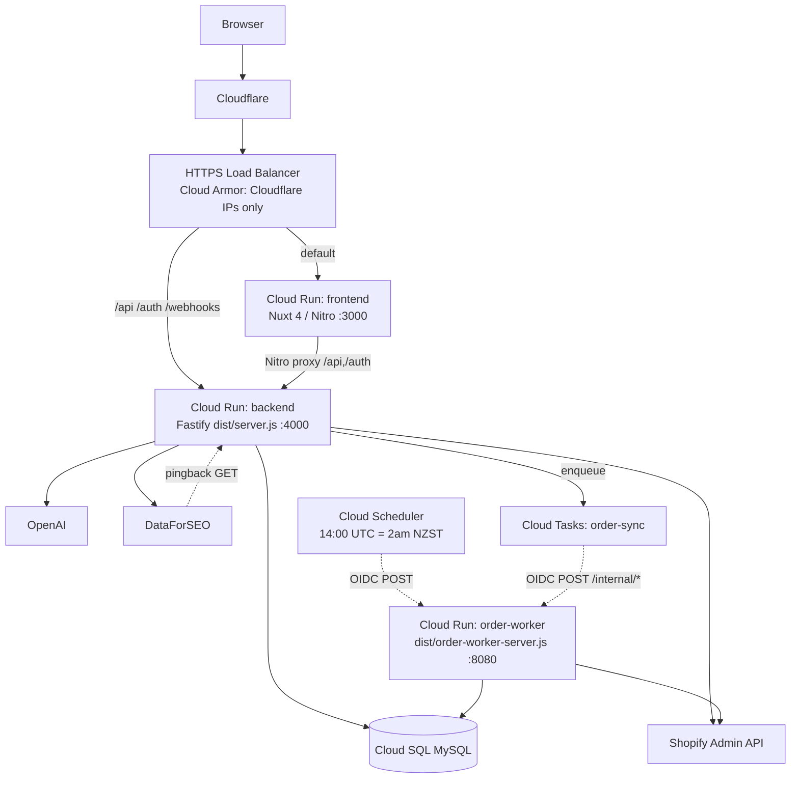
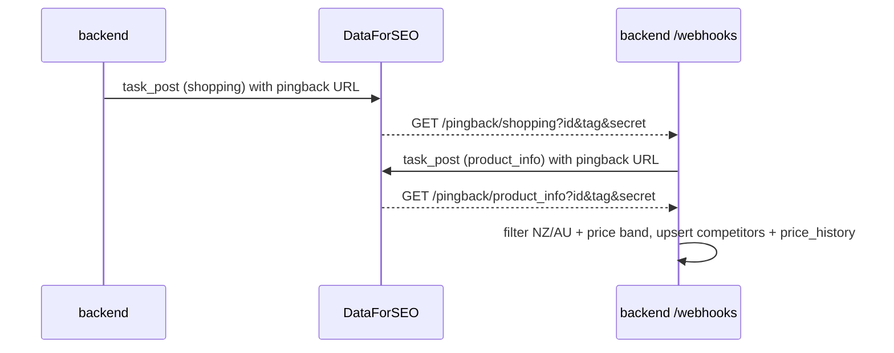

# Architecture

How Price Insight is structured at runtime, and why. Everything here is verified
against source; where prose docs (`README.md`, `k8s/README.md`) disagree, the
code wins.

## System shape

Three **Google Cloud Run** services plus managed data/queue services. The
backend and order-worker share one Docker image (`apps/backend/Dockerfile`) but
run different entrypoints; the frontend has its own image.

## Why three services

- **frontend** (`apps/frontend`) — SSR UI only, ingress restricted to the load
  balancer (`ingress = INGRESS_TRAFFIC_INTERNAL_LOAD_BALANCER` in
  `infra/terraform/cloud-run.tf`). It never talks to MySQL; it proxies `/api/**`
  and `/auth/**` to the backend (`apps/frontend/nuxt.config.ts` `routeRules`).
- **backend** (`apps/backend/src/app.ts` → `buildApp`) — the full API surface:
  auth, products, orders, competitors/analysis, reports, and the DataForSEO +
  Shopify webhook receivers.
- **order-worker** (`apps/backend/src/order-worker-server.ts`) — a deliberately
  **narrower** process. It wires only DB + Shopify GraphQL + Cloud Tasks and
  registers only `/internal/*` routes. It exists so the identity that runs
  scheduled/queued order sync has a least-privilege secret scope (no
  OpenAI/DataForSEO/session secrets — see `service-accounts.tf`). Cloud Run runs
  it by overriding the image command to `node dist/order-worker-server.js`
  (`.github/workflows/deploy.yml` `deploy-order-worker`).

## Request path

Cloudflare → GCP HTTPS LB. The URL map (`infra/terraform/load-balancer.tf`)
routes `/api*`, `/auth*`, `/webhooks*` to the backend NEG and everything else to
the frontend NEG. Cloud Armor (`cloud-armor.tf`) allows only Cloudflare IP
ranges to the **frontend** origin (default-deny); the backend must stay public
because DataForSEO pingbacks and Shopify webhooks call it directly.

## The three pipelines

### 1. Product / order import
`ShopifyService` (REST) and `ShopifyGraphQLService` fetch catalogue/orders;
`ProductRepository`/`OrderRepository` upsert into MySQL. Manual entry points:
`POST /api/products/sync`, `POST /api/orders/sync`. Scheduled path: Cloud
Scheduler → order-worker `/internal/scheduled-order-discovery` fans out one
Cloud Task per changed order → `/internal/sync-order` upserts it
(`routes/internal-sync.ts`).

### 2. Competitor discovery (asynchronous)

Trigger: `CompetitorAnalysisService.searchAndSuggest` or
`POST /api/products/find-competitors`. Webhooks live in
`routes/dataforseo-webhook.ts`; when Cloud Tasks is configured they enqueue
processing (`process-*-pingback`) handled in `routes/internal-competitor.ts`,
otherwise they process inline (local-dev fallback). Filtering is in
`lib/competitor-filter.ts`.

### 3. AI report
`AiReportService.generateReport` (`services/ai-report-service.ts`) gathers
product + confirmed competitors (≤20) + PII-stripped sales, hashes the input,
inserts a `pending` `product_ai_reports` row, calls
`openai.chat.completions.parse` with a Zod `response_format`, and stores the
parsed result or the failure reason.

## Dependency wiring

`buildApp` constructs repositories and services once and attaches them with
`app.decorate(...)` (typed in `types/fastify.d.ts`). Optional integrations are
`null` when their env is absent (Shopify, Cloud Tasks), which is how the same
image runs fully in the cloud and degraded-but-functional locally. Protected API
routes are grouped under a Fastify sub-scope whose `preHandler` is
`requireSession` (`lib/require-session.js`); `auth` and `webhooks` sit outside
that scope.

## Persistence

MySQL 8 via Drizzle (`db/index.ts`, `db/schema.ts`). The connection auto-selects
a Cloud SQL unix socket when `MYSQL_HOST` starts with `/cloudsql/`, else a TCP
pool with TLS — this is what lets the same code run against the Cloud SQL
connector volume in production and a local MySQL in dev.
