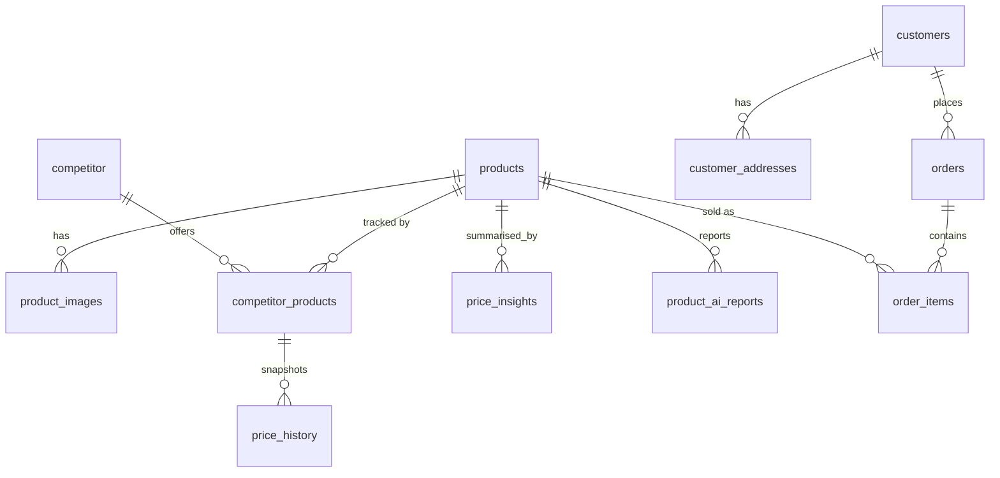

# Database

MySQL 8 accessed through Drizzle ORM. Schema:
`apps/backend/src/db/schema.ts`. Connection: `apps/backend/src/db/index.ts`.
Migrations: generated SQL in `apps/backend/drizzle/*.sql`.

## Connection (`db/index.ts`)

`createDatabase(env)` builds a `mysql2` pool (limit 10) and wraps it with
`drizzle(pool, { schema, mode: "default" })`. It branches on `MYSQL_HOST`:

- host starts with `/cloudsql/` → **unix socket** (`socketPath`) — the Cloud SQL
  connector volume mounted at `/cloudsql` in production.
- otherwise → **TCP** with `ssl.rejectUnauthorized: false`.

This single branch is why the same image runs against Cloud SQL in production and
a local MySQL in development without code changes.

## Tables (all in `schema.ts`)

| Table | Purpose | Notable columns / indexes |
|-------|---------|---------------------------|
| `products` | Shopify catalogue | `external_id` (unsigned bigint), `price`/`cost` `decimal(12,4)`, `handle`, `inventory_quantity`; index on `external_id` |
| `product_images` | Product images | unique `(product_id, external_id)` |
| `competitor` | Distinct competitor sellers | unique `name`; `state` default `active` |
| `competitor_products` | A competitor's offer for one product | `status` (`suggested`/`confirmed`), `country`, `google_position`, unique `(product_id, competitor_id, external_id)` |
| `price_history` | Price snapshots of an offer | `extracted_price` `decimal(12,4)`, `captured_at` |
| `price_insights` | Stored analysis summary | `min_price`/`max_price`, `market_position`, `summary` |
| `customers` / `customer_addresses` | Shopify customers | unique `shopify_customer_id` / `shopify_address_id` |
| `orders` | Shopify orders | unique `shopify_order_id`, index on `shopify_updated_at` |
| `order_items` | Order line items | unique `shopify_line_item_id`, FK `product_id` `set null` |
| `product_ai_reports` | AI report runs | `status`, `model`, `report_types` json, `input_hash`, `input_snapshot`/`output` json |

Conventions: money is `decimal(12,4)` (`moneyColumn` helper); Shopify IDs are
unsigned `bigint` (`shopifyId` helper); columns are snake_case in SQL, camelCase
in Drizzle. FKs cascade on delete for owned children (images, competitor_products,
price_history) and `set null`/`restrict` where history must survive
(order_items→products, competitor_products→competitor).

## Migrations

Seven committed migrations, `0000_initial_schema.sql` … `0006_dry_shooting_star.sql`
with matching `drizzle/meta/*_snapshot.json` and `_journal.json`. Workflow
(`drizzle.config.ts`, `db:generate` script):

1. Edit `schema.ts`.
2. `pnpm --filter @price-insight/backend db:generate` → new `drizzle/NNNN_*.sql`.
3. Commit the generated SQL (never hand-edit it).
4. Deploy — the `backend-migrate` Cloud Run Job runs `dist/db/run-migrations.js`
   against Cloud SQL **before** traffic is routed.

`run-migrations.ts` applies pending migrations and self-heals `__drizzle_migrations`
drift. **`db:push` must never be used against shared environments** (per
`CLAUDE.md`) — it applies schema without recording migration history.

Unknown: seed data / fixtures — none found in the repository.
