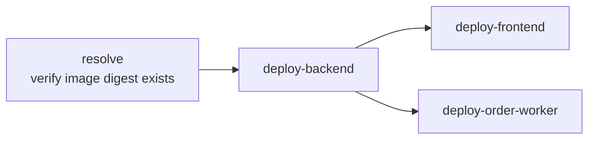

# Deployment

Deploys are **manual** (`workflow_dispatch`) and image-immutable: build once,
deploy by digest. Migrations are applied **before** traffic is routed.

## Build (`.github/workflows/build.yml`)

Manual inputs: `ref` (default `master`), `target` (`all`/`backend`/`frontend`).
Auth to GCP via **Workload Identity Federation** (no long-lived keys):
`price-insight-ci@wd-tools.iam.gserviceaccount.com`. Each job builds with
`docker/build-push-action` and pushes two tags to Artifact Registry — the commit
SHA (immutable) and `latest`:

```
australia-southeast1-docker.pkg.dev/wd-tools/price-insight/price-insight-backend:<sha>
australia-southeast1-docker.pkg.dev/wd-tools/price-insight/price-insight-frontend:<sha>
```

The frontend build resolves the live backend Cloud Run URL and passes it as
`--build-arg NUXT_BACKEND_URL` so the Nitro proxy targets are baked correctly
(see `apps/frontend/Dockerfile`).

## Deploy (`.github/workflows/deploy.yml`)

Inputs: `target` (`all`/`backend`/`frontend`/`order-worker`), optional
`commit_sha`. Jobs:



- **resolve** — validates the SHA and resolves the image **digest** from GAR
  (fails fast if Build hasn't run).
- **deploy-backend** —
  1. record current revision (for rollback),
  2. update + `execute --wait` the `backend-migrate` Job on the new image
     (applies pending Drizzle migrations; non-zero fails the step and skips deploy),
  3. `gcloud run deploy backend` by digest,
  4. health check `GET /api/health` (retries),
  5. **on health failure, `update-traffic` back to the previous revision** and
     fail the job.
- **deploy-frontend** — deploy the frontend image by digest.
- **deploy-order-worker** — deploys the **backend** image by digest but overrides
  `--command=node --args=dist/order-worker-server.js`.

## Local / manual path (`infra/deploy-backend.sh`)

Mirrors CI ordering for emergencies: `build+push → migrate → deploy` with
`set -euo pipefail` so a failed migration aborts before the service is deployed.
Defaults: `PROJECT_ID=wd-tools`, `REGION=australia-southeast1`.

## Why migrate-before-traffic

Cloud Run serves via `node dist/server.js`, which does **not** run migrations
(`CLAUDE.md`). If a new image referenced columns the DB lacked, the live service
would break (the "cost incident"). The `backend-migrate` Job runs
`dist/db/run-migrations.js` against Cloud SQL first; only on success does the new
revision go live.

## Docker images

Both `apps/backend/Dockerfile` and `apps/frontend/Dockerfile` are multi-stage
`node:22-alpine`, install with `pnpm --filter` (frozen lockfile), run under
`tini`, and run as the non-root `node` user. Backend copies `dist/` **and**
`drizzle/` (so the migrate Job has the SQL); frontend ships `.output/`.

## Terraform-managed infra changes

Infrastructure (services, jobs, LB, IAM, secrets) is applied via
`.github/workflows/infra-terraform.yml` (apply) and validated on PRs by
`infra-terraform-plan.yml`. Cloud Run image/traffic are under
`lifecycle.ignore_changes`, so Terraform never reverts a CI deploy.

Unknown: staging/preview environments — none defined in the repository (single
production project `wd-tools`).
