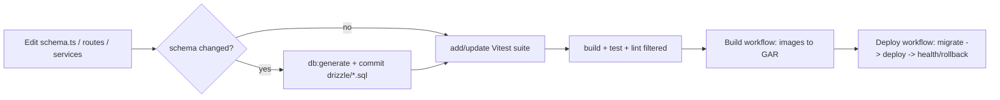

# Development Workflow

## Local setup

Prerequisites: Node 22 (Docker images use `node:22-alpine`), `pnpm@10.28.2`, a
local MySQL. Redis is **not** required (no Redis in current code).

```bash
pnpm install
cp apps/backend/.env.example apps/backend/.env     # fill MySQL, DataForSEO, OpenAI, Shopify (optional)
cp apps/frontend/.env.example apps/frontend/.env    # set NUXT_BACKEND_URL (default http://localhost:4000)
pnpm dev                                            # all apps via turbo
```

Ports: frontend `3000` (`nuxt dev`), backend `4000` (`config/env.ts` default).
Note `apps/frontend/.env.example` still lists Google-OAuth vars that current auth
does not use — the live auth is a single password (`DEV_AUTH_PASSWORD` /
backend `/auth/login`).

## Common commands

```bash
# root (turbo fan-out)
pnpm dev | pnpm build | pnpm test | pnpm lint

# backend
pnpm --filter @price-insight/backend dev          # tsx watch
pnpm --filter @price-insight/backend build        # tsc
pnpm --filter @price-insight/backend test          # vitest run
pnpm --filter @price-insight/backend db:generate   # new migration from schema.ts
pnpm --filter @price-insight/backend db:studio     # Drizzle Studio
pnpm --filter @price-insight/backend script        # tsx src/cli.ts

# frontend
pnpm --filter @price-insight/frontend dev|build|preview

# core
pnpm --filter @price-insight/core test
```

One-off maintenance scripts live in `apps/backend/src/scripts/` and run via `tsx`
locally, or via the `backend-script-runner` Cloud Run Job in production
(`cloud-run-jobs.tf`).

## Making changes



- **DB changes:** edit `db/schema.ts` → `db:generate` → commit the generated SQL
  → deploy through a migrate path. Never hand-edit migrations; never `db:push`
  to shared envs (`CLAUDE.md`).
- **New endpoint:** add a route plugin under `routes/`, wire deps via
  `app.decorate` in `app.ts` (+ `types/fastify.d.ts`), validate with Zod, throw
  `AppError`, add a `__tests__/*.test.ts`.
- **Infra:** change `infra/terraform/`, never ad-hoc `gcloud` mutations; PRs get
  a `terraform plan` via `infra-terraform-plan.yml`.

## Repository rules (from `CLAUDE.md` / `AGENTS.md`)

- Ask before `git push` / any remote push.
- Migrations apply at **deploy time** via the `backend-migrate` Job, not at
  container start — don't add a migration without deploying it through CI
  (`deploy.yml`) or `infra/deploy-backend.sh`.
- Use Mermaid (not ASCII) for diagrams.
- `AGENTS.md` describes an AI-worker worktree model (pi-manager / pi-implementer /
  pi-tester) with investigation-before-code and human approval before merge.

## Branch / deploy cadence

Build and Deploy are **manual** `workflow_dispatch` (default `ref: master`); there
is no auto-deploy on push. Deploys are by image digest, migrate-before-traffic,
with health-check rollback (see `docs/deployment.md`).
