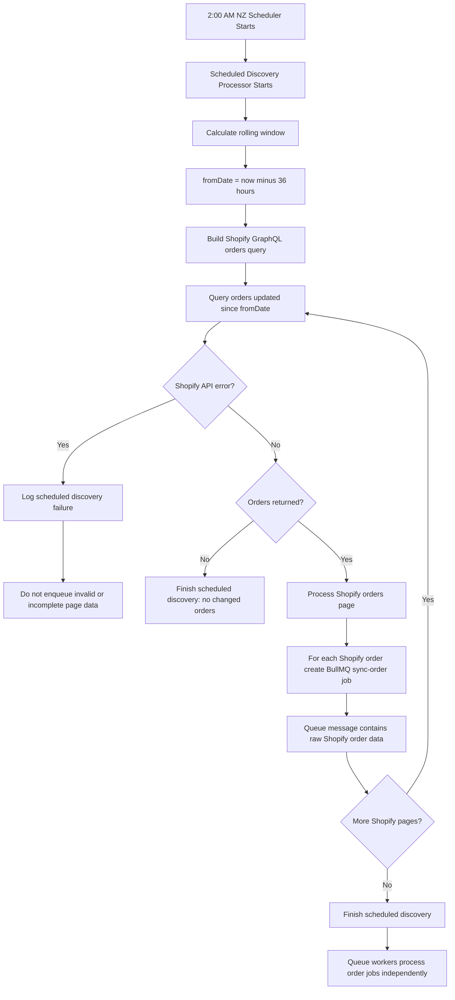
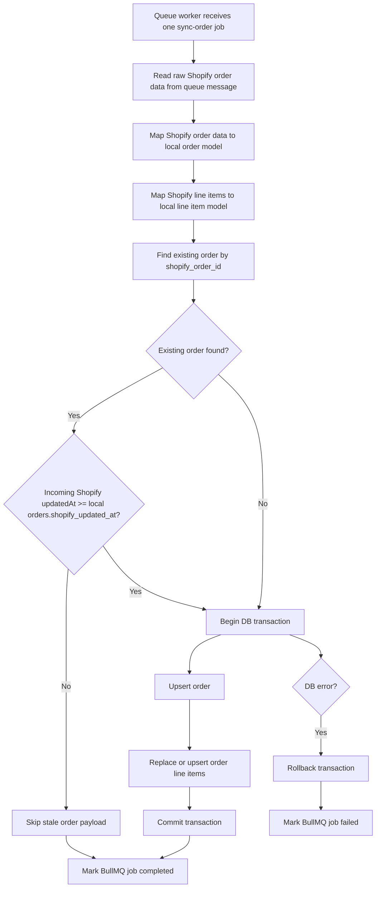
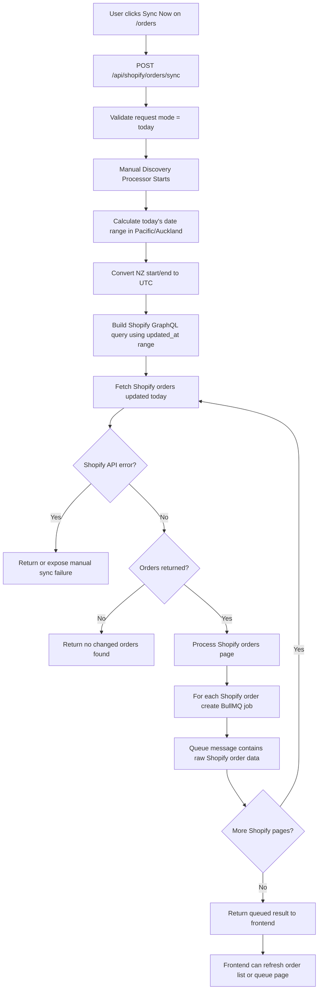

# Task: Shopify Order Sync Implementation — Scheduled + Manual Queue Processing

## Goal

Implement Shopify order sync for Price Insight using a queue-based workflow.

The system must support:

1. Scheduled 2 AM NZ order discovery.
2. Manual `Sync Now` from `/orders`.
3. One BullMQ queue job per Shopify order.
4. Queue worker processes one raw Shopify order payload at a time.
5. Safe upsert into existing order tables.
6. Use existing `orders.shopify_updated_at` to prevent stale data overwrites.

Do **not** implement Shopify webhooks in this task.

---

## Phase 1 — Investigation Only (ignore if you has been done)

Do not edit implementation files yet.

Investigate:

1. Existing Shopify integration code.
2. Existing order table schema.
3. Existing `orders.shopify_updated_at` usage.
4. Existing backend route/service/repository patterns.
5. Existing BullMQ or Redis setup.
6. Existing scheduler/cron setup.
7. Existing `/orders` page and `Sync Now` button behavior.
8. Existing test setup.
9. Existing environment variable/config patterns for Shopify.
10. Existing migration approach.

Return:

- affected files
- existing schema findings
- queue design proposal
- scheduler design proposal
- manual sync endpoint proposal
- risks
- test plan
- validation commands

End Phase 1 with:

```text
Waiting for Tony approval.
```

---

## Business Context

Price Insight needs Shopify order data for pricing analysis.

Order data will support:

- units sold
- product revenue
- average selling price
- discount impact
- refunds/cancellations
- demand trend
- future LLM price recommendations

---

## Important Architecture Decision

The scheduler/manual processor fetches Shopify orders.

The queue worker does **not** fetch Shopify orders again.

The queue message must contain the raw Shopify order data.

Correct workflow:

```text
Scheduler/manual processor
→ fetch Shopify orders from GraphQL
→ create one queue job per Shopify order
→ queue job contains raw Shopify order payload
→ queue worker maps and saves that one order
```

---

## Core Rules

### Rule 1 — Use Shopify GraphQL Admin API

Use Shopify GraphQL Admin API to fetch orders.

Do not build new order sync on Shopify REST Admin API unless investigation proves existing code already uses REST and changing it is too risky.

---

### Rule 2 — One queue job per order

The discovery processor creates one queue job for each Shopify order.

Example:

```text
Shopify returns 20 updated orders
→ create 20 BullMQ jobs
→ each job contains one raw Shopify order payload
```

---

### Rule 3 — Queue worker stores one order only

The queue worker must process one raw Shopify order payload at a time.

The worker must:

```text
read raw Shopify order from queue
→ map order
→ map line items
→ compare Shopify updatedAt
→ upsert order
→ replace/upsert line items
→ complete/fail job
```

---

### Rule 4 — Use existing `orders.shopify_updated_at`

Use `orders.shopify_updated_at` to compare Shopify source freshness.

Do **not** use local `orders.updated_at` for Shopify freshness comparison.

Meaning:

```text
orders.shopify_updated_at = when Shopify says the order changed
orders.updated_at         = when Price Insight DB row was updated locally
```

When processing one raw Shopify order:

```text
incoming Shopify updatedAt < existing orders.shopify_updated_at
→ skip update because queue payload is stale

incoming Shopify updatedAt >= existing orders.shopify_updated_at
→ update order and line items
```

---

### Rule 5

Use BullMQ job status for:

```text
waiting
active
completed
failed
delayed
retrying
```

Use existing order row timestamps for local save tracking.

---

### Rule 6 — Manual Sync Now syncs today only

The `/orders` page `Sync Now` button should sync today’s Shopify orders only.

Definition of today:

```text
Pacific/Auckland local date
```

Manual sync should:

```text
calculate today start/end in NZ time
convert to UTC
fetch Shopify orders updated today
create one queue job per order
```

Use `updated_at`, not only `created_at`.

---

### Rule 7 — Scheduled sync is incremental / rolling window

For MVP, scheduled sync should not reload all orders.

Use one of these approaches after investigation:

Preferred simple option:

```text
2 AM scheduled sync
→ fetch Shopify orders updated in last 24 hours
→ create one queue job per order
```

```text
2 AM scheduled sync
→ read last discovery timestamp
→ subtract 10-minute buffer
→ fetch Shopify orders updated since fromDate
→ create one queue job per order
```

Do not introduce a complex sync-run cursor system in this task.

---

## Required Job Types

Use one BullMQ queue:

```text
shopify-order-sync
```

Use one main job type:

```text
sync-order
```

Differentiate source using the payload:

```text
source = scheduled_2am | manual
```

Future source, not in this task:

```text
source = webhook
```

---

## Queue Job Payload

Each job must contain one raw Shopify order payload.

Example:

```json
{
  "type": "sync-order",
  "source": "scheduled_2am",
  "shopifyOrderId": "gid://shopify/Order/1000001051",
  "orderName": "#1051",
  "shopifyUpdatedAt": "2026-06-05T03:55:00Z",
  "shopifyOrder": {
    "id": "gid://shopify/Order/1000001051",
    "name": "#1051",
    "createdAt": "2026-06-05T03:50:00Z",
    "updatedAt": "2026-06-05T03:55:00Z",
    "processedAt": "2026-06-05T03:50:30Z",
    "cancelledAt": null,
    "displayFinancialStatus": "PAID",
    "displayFulfillmentStatus": "UNFULFILLED",
    "currencyCode": "NZD",
    "subtotalPriceSet": {
      "shopMoney": {
        "amount": "79.80",
        "currencyCode": "NZD"
      }
    },
    "totalPriceSet": {
      "shopMoney": {
        "amount": "89.70",
        "currencyCode": "NZD"
      }
    },
    "lineItems": {
      "nodes": []
    }
  }
}
```

---

## Scheduled Sync Workflow



---

## Queue Worker Workflow



---

## Manual Sync Now Workflow



---

## Shopify GraphQL Requirements

Investigate exact Shopify order query shape.
Shopify order sample data in

```text
~/worker/doc/data/shopify-orders.json
```

Required order fields:

```text
id
name
createdAt
updatedAt
processedAt
cancelledAt
displayFinancialStatus
displayFulfillmentStatus
currencyCode
subtotalPriceSet
totalDiscountsSet
totalShippingPriceSet
totalTaxSet
totalPriceSet
tags
sourceName
lineItems
```

Required line item fields:

```text
id
title
sku
vendor
quantity
variantTitle
variant id
product id
originalUnitPriceSet
discountedTotalSet
```

Must support:

```text
pagination
updated_at filter
date range filter for manual today sync
```

---

## Backend Endpoint

Implement or prepare:

```text
POST /api/shopify/orders/sync
```

Payload:

```json
{
  "mode": "today",
  "source": "manual"
}
```

Expected behavior:

```text
validate request
fetch today's updated Shopify orders
enqueue one sync-order job per raw Shopify order
return queued result
```

Example response:

```json
{
  "status": "queued",
  "source": "manual",
  "mode": "today",
  "ordersDiscovered": 8,
  "jobsEnqueued": 8,
  "message": "Today's Shopify orders have been queued for sync."
}
```

---

## Frontend Integration

The `/orders` page `Sync Today` button should call:

```text
POST /api/shopify/orders/sync
```

with:

```json
{
  "mode": "today",
  "source": "manual"
}
```

Expected UI behavior:

```text
disable button while submitting
show queued/syncing status
show jobs queued count if returned
allow user to refresh orders or open /orders/queue
show error if request fails
```

---

## Persistence Rules

When processing a queue job:

```text
begin transaction
  check existing order by shopify_order_id
  compare incoming Shopify updatedAt with orders.shopify_updated_at
  skip if stale
  upsert order
  replace or upsert line items
commit
```

For MVP line item handling, acceptable approach:

```text
delete existing line items for this order
insert current line items from Shopify
```

Alternative if existing repo prefers it:

```text
upsert line items by shopify_line_item_id
```

Follow existing project patterns.

---

## Error Handling

### Shopify API fetch error

Discovery processor should:

```text
log error
return failure for manual sync
record scheduler failure if scheduled
not enqueue incomplete/invalid page data
```

### Queue worker DB error

Worker should:

```text
rollback transaction
mark BullMQ job failed
allow BullMQ retry policy to handle retry
```

### Stale payload

If incoming Shopify `updatedAt` is older than existing `orders.shopify_updated_at`:

```text
skip DB update
mark job completed
```

This is not a failure.

---

## BullMQ Retry Recommendation

Investigate existing BullMQ configuration first.

Recommended initial settings:

```text
attempts: 3
backoff: exponential
removeOnComplete: keep limited recent history
removeOnFail: keep failed jobs for queue UI/debugging
```

Do not delete failed jobs immediately because `/orders/queue` needs to show failures.

---

## MVP Scope

Build:

1. Shopify order GraphQL fetcher.
2. Scheduled discovery processor.
3. Manual today discovery endpoint.
4. BullMQ queue job creation.
5. Queue worker that processes one raw Shopify order payload.
6. Order mapper.
7. Line item mapper.
8. Upsert order persistence.
9. `orders.shopify_updated_at` freshness check.
10. Pagination.
11. Manual `Sync Today` backend support.
12. Tests for mapper, date range, queue payload, and stale update prevention.

Do not build in this task (next stage):

```text
Shopify webhook endpoint
webhook HMAC verification
sync-single-order fetch-from-Shopify worker
advanced analytics
LLM pricing integration
retry/cancel UI buttons
```

---

## Testing Requirements

### Unit tests

- Shopify order mapper.
- Shopify line item mapper.
- NZ today date range calculation.
- UTC conversion.
- GraphQL query date range builder.
- `orders.shopify_updated_at` stale payload comparison.

### Queue tests

- scheduled discovery enqueues one job per Shopify order.
- manual today sync enqueues one job per Shopify order.
- queue job payload contains raw Shopify order data.
- queue worker processes one order payload.
- stale queue payload is skipped and marked complete.

### Persistence tests

- new order is inserted.
- existing order is updated when incoming Shopify updatedAt is newer.
- existing order is skipped when incoming Shopify updatedAt is older.
- line items are replaced/upserted without duplicates.
- DB transaction rolls back on failure.

### Route tests

- `POST /api/shopify/orders/sync` accepts `mode=today`.
- invalid mode is rejected.
- successful request returns jobs queued count.
- Shopify API failure returns clear error.

---

## Validation Commands

Investigate package scripts first.

Only recommend commands that actually exist in the repo.

Likely examples:

```bash
pnpm typecheck
pnpm test
pnpm turbo test --filter=@price-insight/backend
pnpm turbo lint --filter=@price-insight/backend
```

Do not assume these commands exist. Verify before final recommendation.

---

## PR Checklist

- [ ] No secrets committed.
- [ ] No `.env` files edited.
- [ ] Shopify credentials are read from existing safe config.
- [ ] Shopify orders are fetched with GraphQL Admin API.
- [ ] Scheduled discovery does not reload all historical orders.
- [ ] Manual Sync Now only fetches today’s updated orders.
- [ ] One BullMQ job is created per Shopify order.
- [ ] Queue job contains raw Shopify order payload.
- [ ] Queue worker does not fetch Shopify order again for scheduled/manual jobs.
- [ ] Queue worker processes one order payload at a time.
- [ ] Existing `orders.shopify_updated_at` is used for freshness comparison.
- [ ] Local `orders.updated_at` is not used for Shopify freshness comparison.
- [ ] Older queued Shopify payloads cannot overwrite newer local order data.
- [ ] Orders are upserted safely.
- [ ] Line items do not duplicate.
- [ ] Failed jobs remain visible for queue UI/debugging.
- [ ] Tests cover mapper, manual date range, queue payload, and stale update prevention.
- [ ] Validation commands pass.

---

## Approval Gate

Phase 1 is investigation only.

Do not implement until Tony approves:

- queue design
- scheduler approach
- manual sync behavior
- GraphQL query shape
- persistence strategy
- stale Shopify payload rule

End Phase 1 with:

```text
Waiting for Tony approval.
```
