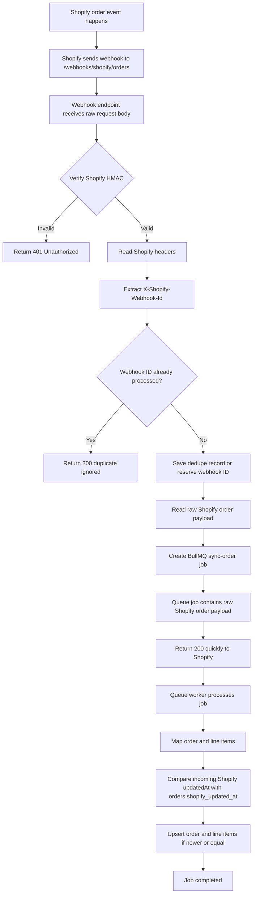

# Task: Shopify Webhook Real-Time Order Sync Planning

## 1. Goal

The goal is to investigate and plan Shopify webhook-based real-time order updates for Price Insight.

The system should support:

- Shopify order webhook endpoint
- HMAC verification using raw request body
- webhook deduplication
- BullMQ `sync-order` job enqueueing
- reuse of the existing order queue worker
- safe order upsert using `orders.shopify_updated_at`
- compatibility with existing scheduled/manual order sync
- no implementation yet

Do not code yet. This task is for investigation and planning only.

---

## 2. Background

Project:

- Name: Price Insight
- Stack: Node.js/TypeScript backend, Nuxt frontend, BullMQ/Redis queue, Shopify order integration
- Current order sync design:
    - Scheduled sync uses a rolling 36-hour window.
    - Manual `Sync Now` syncs today’s orders only.
    - Scheduled/manual processors fetch Shopify orders first.
    - One BullMQ job is created per Shopify order.
    - Queue job contains one raw Shopify order payload.
    - Queue worker processes one order payload at a time.
    - Queue worker stores/upserts order and line items into DB.
    - `orders.shopify_updated_at` is used to prevent stale data overwrites.
    - `orders.updated_at` is only the local DB row update timestamp.

Current need:

- Add real-time individual order updates using Shopify webhooks.
- Shopify should call Price Insight when an order is created, updated, paid, cancelled, or refunded.
- The webhook path should be public but protected by Shopify HMAC verification.
- App routes and `/api/*` may remain protected by Cloudflare Access.
- Webhook should reuse the existing BullMQ order sync queue if possible.

Important decisions already made:

- Webhook route should be:

```text
POST /webhooks/shopify/orders
```

- Do not use:

```text
/api/webhooks/shopify/orders
```

- Do not add `shopify_sync_state`.
- Do not add `shopify_sync_runs`.
- Reuse BullMQ order sync queue where possible.
- Webhook sync should enqueue a `sync-order` job with source `webhook`.
- Queue worker should process one Shopify order payload and persist it safely.
- Use `orders.shopify_updated_at` for Shopify freshness comparison.
- Do not use `orders.updated_at` for Shopify freshness comparison.

---

## 3. Materials

Inspect:

```text
apps/backend
apps/backend/src
apps/backend/src/routes
apps/backend/src/services
apps/backend/src/jobs
apps/backend/src/queues
apps/backend/src/repositories
apps/backend/src/db
apps/frontend
```

Also inspect any existing files related to:

```text
shopify
orders
order sync
BullMQ
Redis
queue
scheduler
webhooks
middleware
auth
raw body
```

Use existing project patterns first. Do not invent a new structure if the repo already has route/service/job conventions.

Relevant expected webhook URL:

```text
POST /webhooks/shopify/orders
```

Relevant Shopify webhook topics:

```text
orders/create
orders/updated
orders/paid
orders/cancelled
refunds/create
```

Relevant Shopify webhook headers:

```text
X-Shopify-Hmac-SHA256
X-Shopify-Topic
X-Shopify-Shop-Domain
X-Shopify-Webhook-Id
```

Expected BullMQ job shape:

```json
{
  "type": "sync-order",
  "source": "webhook",
  "webhookId": "webhook-abc-123",
  "topic": "orders/updated",
  "shopDomain": "example.myshopify.com",
  "shopifyOrderId": "gid://shopify/Order/1000001051",
  "orderName": "#1051",
  "shopifyUpdatedAt": "2026-06-05T03:55:00Z",
  "shopifyOrder": {
    "id": 1000001051,
    "name": "#1051",
    "updated_at": "2026-06-05T03:55:00Z"
  }
}
```

Important payload-shape note:

Shopify webhook payloads may use REST-style field names:

```text
updated_at
created_at
cancelled_at
line_items
```

Existing scheduled/manual GraphQL order payloads may use GraphQL-style field names:

```text
updatedAt
createdAt
cancelledAt
lineItems
```

Investigate whether the existing mapper supports both or whether a webhook normalization layer is needed.

---

## 4. Boundaries

Allowed:

- Read/search code
- Inspect existing routes, middleware, queue, worker, and mapper code
- Inspect existing tests and scripts
- Identify affected files
- Propose implementation approach
- Propose schema/table changes only if necessary
- Propose test plan
- Create/update plan file only, if the repo workflow requires it

Not allowed:

- Do not edit source code
- Do not edit tests
- Do not run migrations
- Do not change dependencies
- Do not modify secrets
- Do not edit `.env`
- Do not change deployment config
- Do not change Cloudflare config
- Do not implement webhook logic yet
- Do not implement scheduled/manual sync changes unless required for integration and approved
- Do not add retry/cancel UI
- Do not add advanced webhook dashboard

Approval required before:

- DB schema changes
- new webhook event table
- auth/security middleware changes
- Cloudflare Access assumptions
- queue payload shape changes
- mapper changes that affect scheduled/manual sync
- introducing new dependencies
- changing existing order sync worker behavior

---

## 5. Investigation Requirements

Report the following.

### 1. Current implementation

Explain:

- how order sync works now
- where scheduled/manual sync lives
- where BullMQ queue is defined
- where queue worker processes order payloads
- how order mapper works
- how `orders.shopify_updated_at` is used
- how route middleware/auth currently works
- whether raw body access is already supported
- whether `/webhooks/*` routes already exist

### 2. Affected areas

Identify affected files/packages for:

- backend routes
- middleware/raw body handling
- Shopify HMAC utility
- webhook dedupe storage
- BullMQ queue job creation
- order sync worker compatibility
- order mapper / payload normalization
- tests
- config/env variable access

### 3. Risks

Cover these risks:

- webhook endpoint accidentally protected by app auth or Cloudflare Access
- invalid HMAC accepted
- raw body unavailable because JSON middleware parsed it first
- duplicate webhooks enqueue duplicate jobs
- webhook payload shape differs from GraphQL payload shape
- older webhook data overwrites newer local data
- queue enqueue failure causes Shopify retries
- unsupported topics processed incorrectly
- storing sensitive webhook payload data unnecessarily
- breaking scheduled/manual sync mapper behavior
- route exposes internal error details
- webhook endpoint bypass rule is too broad

### 4. Options

Provide at least two options.

#### Option A: webhook payload as raw order data

Flow:

```text
Shopify webhook
→ verify HMAC
→ dedupe webhook ID
→ enqueue sync-order with raw webhook order payload
→ queue worker maps and saves payload
```

Pros:

- fewer Shopify API calls
- matches existing scheduled/manual queue design
- fast webhook processing
- worker reuses raw-payload processing model

Cons:

- webhook payload may use REST-style fields
- mapper may need normalization
- payload may not include every field needed by existing DB mapping

#### Option B: webhook payload as trigger only

Flow:

```text
Shopify webhook
→ verify HMAC
→ dedupe webhook ID
→ extract order ID
→ enqueue sync-order-by-id
→ worker fetches latest order from Shopify GraphQL
→ stores order
```

Pros:

- freshest order data
- consistent GraphQL payload shape
- less mapper complexity if scheduled/manual already use GraphQL order shape

Cons:

- extra Shopify API calls
- must handle Shopify GraphQL throttling
- slower queue worker
- different worker path from raw-payload scheduled/manual jobs

Recommendation rule:

```text
Use Option A if webhook payload contains all fields required by current DB mapping and normalization is low risk.
Use Option B if webhook payload is incomplete or mapper changes would be risky.
```

### 5. Test impact

Identify tests needed for:

- HMAC verification success/failure
- raw body handling
- case-insensitive header parsing
- duplicate webhook ID handling
- valid webhook enqueue
- invalid HMAC does not enqueue
- unsupported topic behavior
- webhook payload normalization
- stale payload skip using `orders.shopify_updated_at`
- queue enqueue failure response
- route does not require user session

### 6. Edge case testing

Include edge cases:

- missing HMAC header
- invalid HMAC
- malformed JSON body
- missing webhook ID
- duplicate webhook ID
- missing order ID
- missing updatedAt / updated_at
- unsupported topic
- Shopify retries same webhook
- multiple webhooks for same order arrive close together
- scheduled/manual sync and webhook job overlap
- older webhook payload processed after newer scheduled/manual payload
- queue unavailable / Redis down
- DB transaction failure in worker
- raw body middleware conflicts with existing JSON parser
- webhook route accidentally returns non-2xx after enqueue succeeds

### 7. Complexity

Estimate complexity:

```text
Small / Medium / Large
```

Expected complexity is likely:

```text
Medium
```

Reason:

- raw body HMAC verification is security-sensitive
- webhook route must bypass normal auth but remain safe
- dedupe behavior must be correct
- mapper may need to handle REST-style Shopify payloads
- queue worker must remain compatible with scheduled/manual sync

---

## 6. Expected Design Details

### Webhook endpoint

Proposed route:

```text
POST /webhooks/shopify/orders
```

The route should:

1. Accept raw request body.
2. Verify `X-Shopify-Hmac-SHA256`.
3. Read `X-Shopify-Topic`.
4. Read `X-Shopify-Shop-Domain`.
5. Read `X-Shopify-Webhook-Id`.
6. Reject invalid signatures.
7. Dedupe duplicate webhook IDs.
8. Enqueue one BullMQ `sync-order` job.
9. Return 200 quickly after enqueue.
10. Avoid full DB sync inside the HTTP request.

### HMAC rule

Use raw request body.

Do not verify using parsed JSON.

Concept:

```text
rawBody + Shopify app secret
→ HMAC SHA256
→ base64 digest
→ timing-safe compare with X-Shopify-Hmac-SHA256
```

If invalid:

```text
return 401
do not enqueue
do not trust payload
```

### Dedupe strategy

Investigate preferred approach.

#### Option A: DB table

Proposed table:

```text
shopify_webhook_events
```

Suggested fields:

```text
id
webhook_id unique
topic
shop_domain
shopify_order_id
status
received_at
processed_at
error_message
created_at
updated_at
```

Pros:

- durable audit trail
- easier debugging
- useful for queue UI later

Cons:

- requires schema change

#### Option B: Redis/BullMQ jobId dedupe

Use:

```text
jobId = webhookId
```

Pros:

- no schema change
- faster MVP

Cons:

- retention-dependent
- less audit/debug visibility

Recommendation should explain trade-off and identify whether a DB change is worth it.

### Queue integration

Webhook should enqueue the same queue job type used by order sync:

```text
sync-order
```

Payload source:

```text
source = webhook
```

Worker should process it like scheduled/manual order payloads.

### Shopify UpdatedAt rule

Use existing:

```text
orders.shopify_updated_at
```

Do not use:

```text
orders.updated_at
```

for Shopify freshness comparison.

Rule:

```text
incoming Shopify updatedAt < existing orders.shopify_updated_at
→ skip update and mark job completed

incoming Shopify updatedAt >= existing orders.shopify_updated_at
→ update order and line items
```

This protects against:

- duplicate webhooks
- delayed webhook delivery
- scheduled sync overlap
- manual sync overlap
- queue retry ordering
- older payloads overwriting newer local data

---

## 7. Webhook Workflow



---

## 8. Queue Job Payload

Webhook should enqueue the same `sync-order` job type used by scheduled/manual sync.

Example:

```json
{
  "type": "sync-order",
  "source": "webhook",
  "webhookId": "webhook-abc-123",
  "topic": "orders/updated",
  "shopDomain": "example.myshopify.com",
  "shopifyOrderId": "gid://shopify/Order/1000001051",
  "orderName": "#1051",
  "shopifyUpdatedAt": "2026-06-05T03:55:00Z",
  "shopifyOrder": {
    "id": 1000001051,
    "name": "#1051",
    "updated_at": "2026-06-05T03:55:00Z"
  }
}
```

Notes:

- Use `source = webhook`.
- Include `webhookId`.
- Include `topic`.
- Include `shopDomain`.
- Include raw Shopify order payload.
- Normalize `shopifyUpdatedAt` if needed.
- Do not include secrets or HMAC values in the job payload.

---

## 9. Shopify Admin Configuration Context

After backend endpoint exists, configure Shopify Admin webhooks:

```text
Settings
→ Notifications
→ Webhooks
→ Create webhook
```

Create separate webhooks using the same URL:

```text
https://your-domain.com/webhooks/shopify/orders
```

Recommended events:

```text
Order creation
Order update
Order payment
Order cancellation
Refund create
```

Format:

```text
JSON
```

This task should not automate Shopify Admin configuration. Just make the backend endpoint ready.

---

## 10. Cloudflare Access Context

The app may be protected by Cloudflare Access.

The webhook path must be reachable by Shopify.

Expected bypass path:

```text
/webhooks/shopify/*
```

Do not bypass:

```text
/*
/api/*
```

Backend HMAC verification remains the security layer for this route.

Do not change Cloudflare config in this task. Report required Cloudflare change for Tao to apply separately if needed.

---

## 11. Error Handling Expectations

### Invalid HMAC

```text
return 401
do not enqueue
log minimal security warning
```

### Duplicate webhook

```text
return 200
do not enqueue duplicate
```

### Unsupported topic

Investigate and recommend one behavior:

```text
return 200 and ignore
```

or:

```text
return 400
```

Default preference:

```text
return 200 and ignore unsupported topics after HMAC verification
```

Reason: avoid unnecessary Shopify retries for topics we intentionally do not process.

### Queue enqueue failure

```text
return 500
Shopify will retry
log error
```

### Mapper/persistence failure

```text
BullMQ job fails
BullMQ retry policy handles retry
failed job remains visible in /orders/queue
```

---

## 12. MVP Scope

Plan for implementation of:

1. `POST /webhooks/shopify/orders`.
2. Raw body handling for webhook route.
3. Shopify HMAC verification utility.
4. Case-insensitive Shopify header parsing.
5. Webhook dedupe using `X-Shopify-Webhook-Id`.
6. Enqueue BullMQ `sync-order` job with raw order payload.
7. Queue worker compatibility with `source = webhook`.
8. Mapping/normalization support for webhook order payload if needed.
9. Tests for HMAC, duplicate, enqueue, unsupported topics, and invalid payload cases.

Do not plan to implement in this task:

```text
scheduled sync
manual sync
queue UI
retry/cancel UI buttons
advanced webhook dashboard
Cloudflare config automation
Shopify Admin automation
```

---

## 13. Testing Requirements

### Unit tests

- HMAC verification succeeds with valid raw body/signature.
- HMAC verification fails with invalid signature.
- HMAC verification fails with missing HMAC header.
- Header parsing is case-insensitive.
- Webhook payload extracts Shopify order ID correctly.
- Webhook payload extracts Shopify updatedAt correctly.
- Webhook payload normalizes REST-style timestamps if needed.
- Unsupported topic behavior matches approved design.

### Route tests

- Valid webhook returns `200`.
- Invalid HMAC returns `401`.
- Duplicate webhook ID returns `200` and does not enqueue again.
- Queue enqueue failure returns `500`.
- Unsupported topic is ignored or rejected according to approved design.
- Route does not require user session.
- Malformed JSON is handled safely after HMAC verification.

### Queue tests

- Webhook creates one `sync-order` job.
- Job payload includes raw Shopify order payload.
- Job source is `webhook`.
- Queue worker handles webhook source.
- Older webhook payload does not overwrite newer `orders.shopify_updated_at`.
- Duplicate webhook does not create duplicate job.

---

## 14. Validation Commands

Investigate package scripts first.

Only recommend commands that actually exist in the repo.

Likely examples:

```bash
pnpm typecheck
pnpm test
pnpm turbo test --filter=@price-insight/backend
pnpm turbo lint --filter=@price-insight/backend
```

Do not assume these commands exist. Verify before final recommendation.

---

## 15. Definition of Done

Planning is complete when you provide:

- current behavior summary
- affected files/packages
- route/middleware proposal
- raw body/HMAC verification approach
- dedupe recommendation
- queue job payload recommendation
- mapper/normalization recommendation
- Cloudflare Access note
- Shopify Admin setup note
- risks/trade-offs
- approval decisions needed
- test plan
- validation commands
- next implementation prompt

End with:

```text
Waiting for Tao approval.
```
