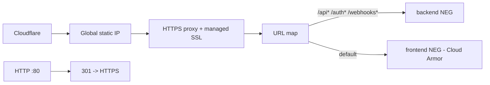

# Infrastructure

Authoritative infra is Terraform under `infra/terraform/`. Provider
`hashicorp/google ~> 6.0`; state in GCS bucket `wd-tools-tfstate`
(`prefix price-insight/terraform.tfstate`, `main.tf`). Project `wd-tools`,
region `australia-southeast1` (`terraform.tfvars`).

## Cloud Run services (`cloud-run.tf`)

| Service | Ingress | Port | Notes |
|---------|---------|------|-------|
| `frontend` | internal load balancer only | 3000 | public invoker (`allUsers`); reached only through the LB |
| `backend` | all | 4000 | public invoker; Cloud SQL volume at `/cloudsql`; secrets from GSM |
| `order-worker` | all (IAM-gated) | 8080 | **no** `allUsers` binding — only the `invoker` SA may call it; command overridden to `dist/order-worker-server.js` by CI |

All start on a bootstrap placeholder image
(`us-docker.pkg.dev/cloudrun/container/hello`); CI replaces it via
`gcloud run deploy`. `lifecycle.ignore_changes` covers `image`, `client`,
`client_version`, and `traffic` so Terraform never reverts a deploy or resets
traffic split.

## Cloud Run Jobs (`cloud-run-jobs.tf`)

- `backend-migrate` — `node dist/db/run-migrations.js`; applies pending Drizzle
  migrations against Cloud SQL. Reuses the backend image/SA/env.
- `backend-script-runner` — runs `dist/scripts/*.js` (default
  `load-recent-orders.js`); override `--args`/`--update-env-vars` per execution.

## Data & queues

- **Cloud SQL** MySQL: connection name `wd-tools:australia-southeast1:wd-tools`
  (`variables.tf`), attached to Cloud Run via the built-in connector volume.
- **Cloud Tasks** (`cloud-tasks.tf`): queue `order-sync`, `max_attempts 3`,
  backoff 2s–60s, `max_concurrent_dispatches 1`. Backend and order-worker have
  `cloudtasks.enqueuer`.
- **Cloud Scheduler**: `scheduled-order-discovery`, `0 14 * * *` UTC (= 2am
  NZST), OIDC POST to order-worker `/internal/scheduled-order-discovery`.

## Networking & edge

- `load-balancer.tf`: one global external HTTPS LB; serverless NEGs for
  frontend/backend; managed SSL cert for `www.qweyha520.bar` + `qweyha520.bar`
  apex redirect; HTTP→HTTPS redirect on the same IP. order-worker is **not**
  attached (private).
- `cloud-armor.tf`: `frontend-cloudflare-only` security policy allows only the
  published Cloudflare IPv4/IPv6 ranges (split across rules due to the 10-range
  cap), default-deny. Ensures the frontend origin is reachable only via
  Cloudflare. Backend has no such policy (must receive webhooks directly).

## Identity & secrets

- `service-accounts.tf`: `backend_runtime` (data source, reused from GKE era),
  `frontend_runtime`, `order_worker_runtime` (least-privilege: Cloud SQL + a
  reduced Shopify/DB secret set only), and a shared `invoker` SA that Cloud
  Tasks/Scheduler attach as the OIDC subject when calling order-worker. Some
  grants (`compute.securityAdmin`, `artifactregistry.reader` for terraform-ci)
  are applied **out-of-band** and documented in comments.
- `secrets.tf`: user-managed GSM secrets for backend/frontend/gateway; Terraform
  seeds `placeholder` versions and `ignore_changes` on `secret_data` so real
  values set via `gcloud secrets versions add` are never overwritten.
- `iam.tf`: CI SA secret-accessor grants; `apis.tf`: enables required APIs.

## CI/CD workflows (`.github/workflows/`)

`build.yml`, `deploy.yml` (see `docs/deployment.md`), `infra-terraform.yml`
(apply), `infra-terraform-plan.yml` (PR plan). All auth via Workload Identity
Federation.

## Legacy (not in use)

`k8s/` (Deployments, Services, Ingress, **`k8s/redis/`**) and `k8s/README.md`
describe the retired GKE + in-cluster-Redis path. They are unused; Cloud Run +
Terraform is the live infrastructure.
